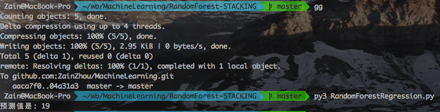
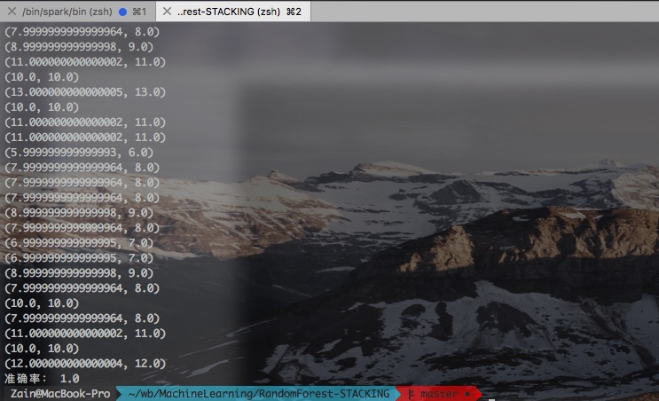

## 随机森林与基于LR的STACKING算法
##### 周政

#### 随机森林算法实现(CART算法建树：误差平方和最小划分数据集)
- 数据集划分方法

```json

# 对连续变量划分数据集，返回数据只包括最后一列
def splitDataSet(dataSet, featIndex, value):
	 leftData, rightData = [], []
	 for dt in dataSet:
	    if dt[featIndex] <= value:
	      leftData.append(dt[-1])
	    else:
	       rightData.append(dt[-1])
	 return leftData, rightData
	 
# 选择最好的数据集划分方式，使得误差平方和最小
def chooseBestFeature(dataSet):
    bestR2 = float('inf')
    bestFeatureIndex = -1
    bestSplitValue = None
    # 第i个特征
    for i in range(len(dataSet[0]) - 1):
        featList = [dt[i] for dt in dataSet]
        # 产生候选划分点
        sortfeatList = sorted(list(set(featList)))
        splitList = []
        # 如果值相同，不存在候选划分点
        if len(sortfeatList) == 1:
            splitList.append(sortfeatList[0])
        else:
            for j in range(len(sortfeatList) - 1):
                splitList.append((sortfeatList[j] + sortfeatList[j + 1]) / 2)
        # 第j个候选划分点，记录最佳划分点
        for splitValue in splitList:
            subDataSet0, subDataSet1 = splitDataSet(dataSet, i, splitValue)
            lenLeft, lenRight = len(subDataSet0), len(subDataSet1)
            # 防止数据集为空，mean不能计算
            if lenLeft == 0 and lenRight != 0:
                rightMean = np.mean(subDataSet1)
                R2 = sum([(x - rightMean)**2 for x in subDataSet1])
            elif lenLeft != 0 and lenRight == 0:
                leftMean = np.mean(subDataSet0)
                R2 = sum([(x - leftMean) ** 2 for x in subDataSet0])
            else:
                leftMean, rightMean = np.mean(subDataSet0), np.mean(subDataSet1)
                leftR2 = sum([(x - leftMean)**2 for x in subDataSet0])
                rightR2 = sum([(x - rightMean)**2 for x in subDataSet1])
                R2 = leftR2 + rightR2
            if R2 < bestR2:
                bestR2 = R2
                bestFeatureIndex = i
                bestSplitValue = splitValue
    return bestFeatureIndex, bestSplitValue

# 去掉第i个属性，生成新的数据集 
def splitData(dataSet, featIndex, features, value):
    newFeatures = copy.deepcopy(features)
    newFeatures.remove(features[featIndex])
    leftData, rightData = [], []
    for dt in dataSet:
        temp = []
        temp.extend(dt[:featIndex])
        temp.extend(dt[featIndex + 1:])
        if dt[featIndex] <= value:
            leftData.append(temp)
        else:
            rightData.append(temp)
    return newFeatures, leftData, rightData
    
```
- 决策树生成方法

```json
# 建立决策树
def regressionTree(dataSet, features):
    classList = [dt[-1] for dt in dataSet]
    # label一样，全部分到一边
    if classList.count(classList[0]) == len(classList):
        return classList[0]
    # 最后一个特征还不能把所有样本分到一边，则划分到平均值
    if len(features) == 1:
        return np.mean(classList)
    bestFeatureIndex, bestSplitValue = chooseBestFeature(dataSet)
    bestFeature = features[bestFeatureIndex]
    # 删除root特征，生成新的去掉root特征的数据集
    newFeatures, leftData, rightData = splitData(dataSet, bestFeatureIndex, features, bestSplitValue)

    # 左右子树有一个为空，则返回该节点下样本均值
    if len(leftData) == 0 or len(rightData) == 0:
        return np.mean([dt[-1] for dt in leftData] + [dt[-1] for dt in rightData])
    else:
        # 左右子树不为空，则继续分裂
        myTree = {bestFeature: {'<' + str(bestSplitValue): {}, '>' + str(bestSplitValue): {}}}
        myTree[bestFeature]['<' + str(bestSplitValue)] = regressionTree(leftData, newFeatures)
        myTree[bestFeature]['>' + str(bestSplitValue)] = regressionTree(rightData, newFeatures)
    return myTree
```
- 决策树测试方法

```json
# 用生成的回归树对测试样本进行测试
def treeClassify(decisionTree, featureLabel, testDataSet):
    firstFeature = list(decisionTree.keys())[0]
    secondFeatDict = decisionTree[firstFeature]
    splitValue = float(list(secondFeatDict.keys())[0][1:])
    featureIndex = featureLabel.index(firstFeature)
    if testDataSet[featureIndex] <= splitValue:
        valueOfFeat = secondFeatDict['<' + str(splitValue)]
    else:
        valueOfFeat = secondFeatDict['>' + str(splitValue)]
    if isinstance(valueOfFeat, dict):
        pred_label = treeClassify(valueOfFeat, featureLabel, testDataSet)
    else:
        pred_label = valueOfFeat
    return pred_label    
```
- 数据处理及启动函数

```json
# 随机抽取样本，样本数量与原训练样本集一样，维度为sqrt(m-1)
def baggingDataSet(dataSet):
    n, m = dataSet.shape
    features = random.sample(dataSet.columns.values[:-1].tolist(), int(math.sqrt(m - 1)))
    features.append(dataSet.columns.values[-1])
    rows = [random.randint(0, n-1) for _ in range(n)]
    trainData = dataSet.iloc[rows][features]
    return trainData.values.tolist(), features

def testHousing():
    df = pd.read_csv('housing.txt')
    labels = df.columns.values.tolist()
    print(type(df.iloc[0,:].values))
    # 生成多棵回归树，放到一个list里边
    treeCounts = 10
    treeList = []
    for i in range(treeCounts):
        baggingData, bagginglabels = baggingDataSet(df)
        decisionTree = regressionTree(baggingData, bagginglabels)
        treeList.append(decisionTree)
    # 对测试样本求预测值
    labelPred = []
    for tree in treeList:
        testData = [0.32982,0,21.89,0,0.624,5.822,95.4,2.4699,4,437,21.2,388.69,15.03] #准确值为18.4
        label = treeClassify(tree, labels[:-1], testData)
        labelPred.append(label)
    print("预测值是: %d" %np.mean(labelPred))
    
if __name__ == '__main__':
    testHousing()
```
- 运行结果



[Github地址](https://github.com/ZainZhou/MachineLearning/tree/master/RandomForest-STACKING)

#### 基于LR的STACKING算法

- 数据类

```json
#本来想多扩展一些数据预处理方法，但是暂时没时间写就没写，所以看起来这个类都点蠢.
class Data(object):
	def __init__(self):
		self.data = None
		self.subDataset = []
	def ImportData(self,path):
		df = pd.read_csv(path)
		self.data = df.iloc[:,1:].values
```
- LR融合学习模型类

```json
#融合学习模型
class FusionLeaner(object):
	def __init__(self):
	#初始化时初始化要用到的模型
		self.lr = LinearRegression()
		self.logistic = LogisticRegression()
		self.nb = GaussianNB()
		self.knn = KNeighborsClassifier()
		self.dt = DecisionTreeClassifier()
		self.rf = RandomForestClassifier(max_depth=2, random_state=0)
		self.trainingDataset = [];
	#对第一次学习用到的模型进行训练
	def FirstTrainingFunc(self,X,Y):
		self.logistic.fit(X,Y)
		self.nb.fit(X,Y)
		self.knn.fit(X,Y)
		self.dt.fit(X,Y)
		self.rf.fit(X,Y)
	#用第一次学习后生成的数据集进行第二次学习训练
	def SecondTrainingFunc(self):
		x = self.trainingDataset[:,:-1]
		y = self.trainingDataset[:,-1]
		self.lr.fit(x,y)
	#生成第二次学习用的数据集
	def GenerateTrainingDataset(self,x,y):
		for i in range(len(x)):
			temp = []
			temp.append(self.dt.predict(x[i]).tolist()[0])
			temp.append(self.logistic.predict(x[i]).tolist()[0])
			temp.append(self.nb.predict(x[i]).tolist()[0])
			temp.append(self.knn.predict(x[i]).tolist()[0])
			temp.append(self.rf.predict(x[i]).tolist()[0])
			temp.append(y[i])
			self.trainingDataset.append(temp)
		self.trainingDataset = np.array(self.trainingDataset)
	#使用训练好的融合模型
	def LrPridict(self,x):
		temp = []
		temp.append(self.dt.predict(x).tolist()[0])
		temp.append(self.logistic.predict(x).tolist()[0])
		temp.append(self.nb.predict(x).tolist()[0])
		temp.append(self.knn.predict(x).tolist()[0])
		temp.append(self.rf.predict(x).tolist()[0])
		return self.lr.predict(temp)
//训练方法上还可以统一封装一次，降低代码重复率
```
- 评价模型准确率函数

```json
def EvaluationFn(x,y,fn):
	result = []
	isRightarr = []
	print('预测值与准确值：')
	for i in range(len(x)):
		result.append(fn(x[i]).tolist()[0])
	for i in range(len(result)):
		print((result[i],y[i]))
		if (result[i]-y[i])**2 < (1e-10):
			isRightarr.append(1)
		else:
			isRightarr.append(0)
	n = np.bincount(np.array(isRightarr))
	return (n[1]/(n[1]+n[0]))
```
- 入口函数进行一些调度和数据集处理

```json
if __name__ == '__main__':
	#读入数据文件生成第一次学习的训练集
	data = Data()
	data.ImportData('abalone.data.txt')
	X1 = data.data[:,:-1]
	Y1 = data.data[:,-1]
	#从数据集中随机取出约80%作为第二次学习的训练集，剩下约20%作为最后的测试集
	trainingIndex = [np.random.randint(0,len(X1)-1) for i in range(int(len(X1)*0.8))]
	X2 = X1[trainingIndex,:]
	Y2 = Y1[trainingIndex]
	X3 = []
	Y3 = []
	for i in range(len(X1)):
		if i in trainingIndex:
			continue
		X3.append(X1[i,:])
		Y3.append(Y1[i])
	#开始学习
	fl = FusionLeaner()
	fl.FirstTrainingFunc(X1,Y1)
	fl.GenerateTrainingDataset(X2,Y2)
	fl.SecondTrainingFunc()
	#评价模型的准确率
	Accuracy = EvaluationFn(X3,Y3,fl.LrPridict)
	print("准确率：",Accuracy)
```
- 运行结果



[Github地址](https://github.com/ZainZhou/MachineLearning/tree/master/RandomForest-STACKING)